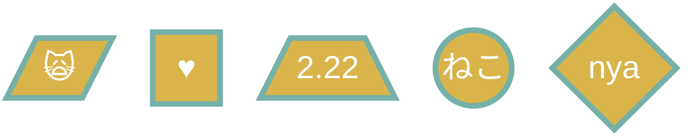
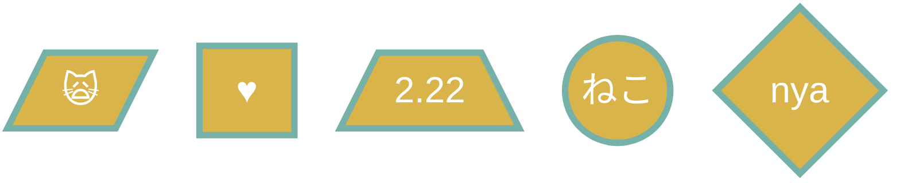
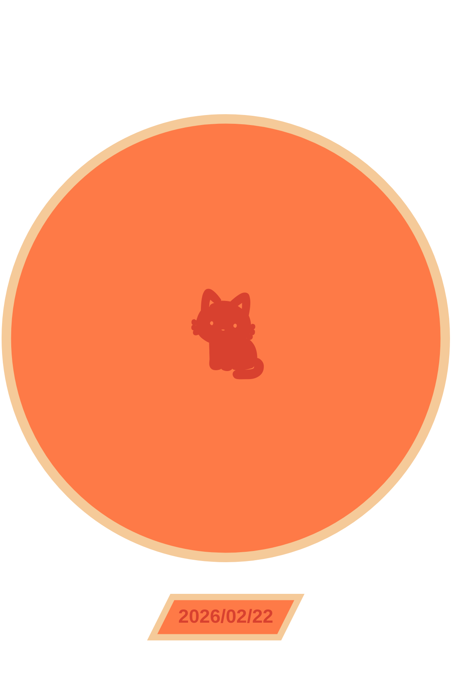
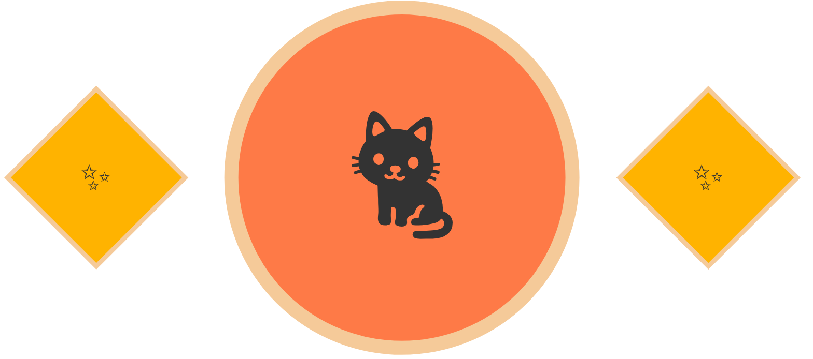

```
fill-------------内側の塗りつぶし 背景色
stroke-----------枠線の色 図形を囲んでいる線   
stroke-width-----枠線の太さ 線の厚み（pxで指定）
color------------文字の色	
```







```
%% は通常、コメントアウト
%%{init: ...}%% は特別な意味を持つ 「ディレクティブ（設定指示）
```

---

### 書き方メモ

```
TD	上 → 下
BT	下 → 上
LR	左 → 右
RL	右 → 左
```

```
A["text"] 四角
A[/"text"\] 三角
A(("text")) 丸
A{"text"} ひし形
A[/"text"/] 平行四辺形
A["text"/] 逆向き平行四辺形（環境による）
```

` subgraph `：内部で使う名前（英数字推奨）
- ` subgraph katachi ` ：katachiが表示名になる
- ` end `：開いたら閉じる

```
rankSpacing　: 80 縦の間隔
nodeSpacing　: 80 横の間隔
```

### color

```
#000000（黒）
#ffffff（白）
#ff0000（赤）
#00ff00（緑）
#0000ff（青）
```
rgb / rgba
```
rgb(255, 0, 0)        :R,G,B
rgba(255, 0, 0, 0.5)  :R,G,B,A（透明度）

A = Alpha 値は0～1
0 → 完全透明
1 → 完全不透明
0.5 → 半透明

```


