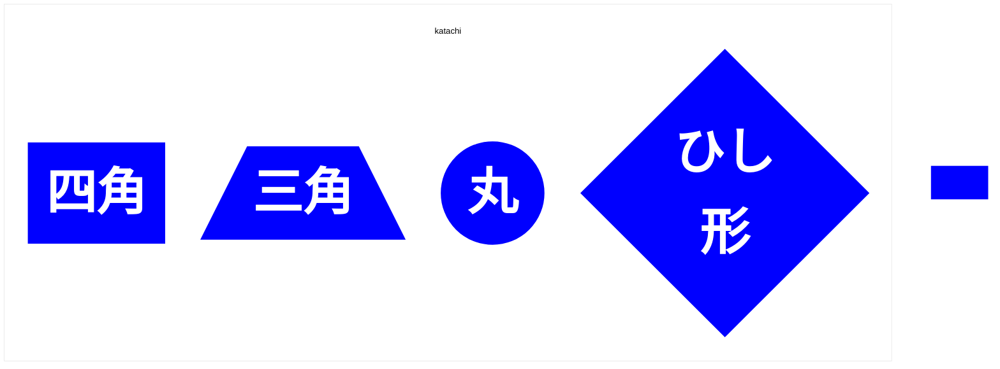

---

- TD	上 → 下
- BT	下 → 上
- LR	左 → 右
- RL	右 → 左

- A["text"] 四角
- A[/""text\] 三角
- A(("text")) 丸
- A{"text"} ひし形
- A[/"text"/] 平行四辺形
- A["text"/] 逆向き平行四辺形（環境による）

- 'rankSpacing': 80 縦の間隔
- 'nodeSpacing': 80 横の間隔

